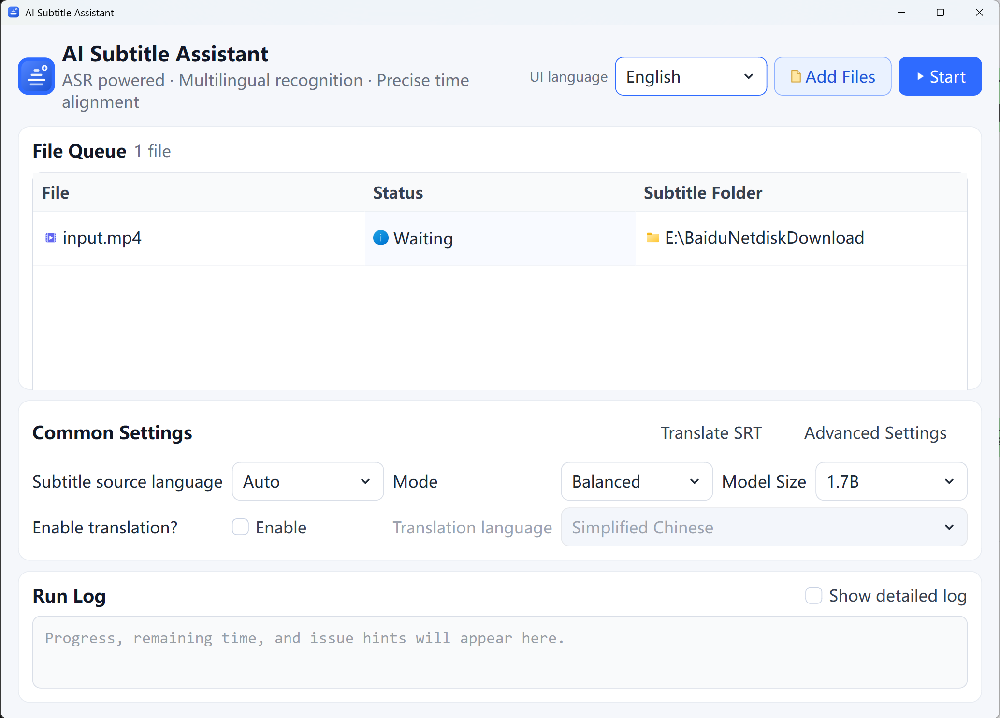

# AISRT - Local AI Subtitle Generator and SRT Translation Tool

Language: [简体中文](README.md) | English

AISRT is a local AI subtitle generator for converting video and audio files into timestamped `.srt` subtitles. It uses local large-model ASR for multilingual speech recognition, combines forced alignment for more accurate subtitle timing, and supports local SRT translation for privacy-friendly offline subtitle workflows.

The project is intentionally scoped as a personal desktop and command-line tool. It prioritizes simplicity, stability, and maintainability. It is not a web UI, backend service, database-backed app, or hosted subtitle platform.

Keywords: local AI subtitle generator, video to SRT, audio to SRT, multilingual ASR, subtitle alignment, SRT translation, offline subtitle tool, Windows subtitle generator, GUI subtitle app, CLI subtitle batch processing.

## Preview



## Features

| Feature | Description |
| --- | --- |
| Multilingual recognition | Supports automatic language detection and manual language selection. |
| Timestamp alignment | Uses a local forced-alignment model to produce subtitles closer to the speech rhythm. |
| Local inference | Runs models locally by default. It does not call DashScope APIs or depend on `qwen3-asr-toolkit`. |
| Batch processing | The GUI supports a multi-file queue; the CLI supports single-file and directory batch processing. |
| Subtitle post-processing | Deduplicates text, fixes overlapping timestamps, wraps long lines, cleans CJK spacing, and renumbers subtitles. |
| Local SRT translation | Translates existing SRT files with local HY-MT models, supports multiple translation languages, and preserves numbering and timestamps. |

> Note: Public project naming uses AISRT. Qwen3-ASR and Qwen3-ForcedAligner appear only as model IDs and technical dependencies.

## Fit

AISRT is suitable for:

- Generating `.srt` subtitles for local video or audio files.
- Personal media processing and offline batch jobs.
- Users who want a GUI for everyday use while keeping a CLI for debugging and scripts.
- Workflows where models, cache, logs, and generated files should stay on the local machine.

AISRT is not suitable for:

- Online subtitle services, multi-user backends, or web applications.
- Workflows that require cloud translation APIs, online collaboration, or automatic subtitle upload.
- Environments without FFmpeg, enough disk space, or access to model downloads.
- Fast long-video processing on CPU-only machines.

## Workflow

```text
Video/audio file
  -> FFmpeg extracts temporary 16k mono WAV
  -> Local ASR model transcribes speech
  -> Local forced-alignment model generates timestamps
  -> Subtitle post-processing
  -> Output .srt file
```

## Quick Start

Windows 10/11 is the primary supported environment. Linux and macOS may work but are not the main validation targets.

```powershell
git clone https://github.com/zkwi/AiSRT.git
cd AiSRT
py -3.11 -m venv .venv
.\.venv\Scripts\Activate.ps1
python -m pip install -U pip
python -m pip install -r requirements.txt
ai-sub doctor
ai-sub-gui --check
```

Start the GUI:

```powershell
ai-sub-gui
```

Process one file from the CLI:

```powershell
ai-sub "movie.mp4" --overwrite
```

You can also use the helper scripts:

- `activate_env.bat`: enter the project virtual environment and set the project-local model cache.
- `open_ui.bat`: start the GUI with the current virtual environment.

## Requirements

- Python 3.10-3.12. Python 3.11 is recommended.
- FFmpeg and ffprobe installed and available from the command line.
- NVIDIA GPU is recommended. CPU can run, but long videos will be much slower.
- First-time use with remote model IDs requires downloading model weights, so reserve enough disk space.

The default install currently uses CUDA PyTorch pinned in `requirements-torch-cu130.txt`:

```text
torch==2.11.0+cu130
torchaudio==2.11.0+cu130
```

If your CUDA or PyTorch environment is different, adjust `requirements-torch-cu130.txt` first, or install matching PyTorch packages manually before installing AISRT dependencies.

## GUI

The GUI is designed for regular users and keeps only common actions on the main window:

- Add files: select one or more video/audio files, or drag files into the window.
- Start processing: generate original ASR subtitles for queued files.
- Enable translation: when checked, the main button becomes "Recognize + Translate", writes original ASR subtitles first, then outputs subtitles in the translation language.
- File queue: shows file name, status, progress, and subtitle directory.
- Progress hints: ASR recognition and subtitle translation show estimated remaining time in `minutes:seconds` format.
- Language settings: UI language follows the system language by default and remembers manual changes; subtitle source language controls ASR; translation language controls translated subtitles.
- Common settings: subtitle source language, whether translation is enabled, translation language, run mode, and model size.
- Advanced settings: device, audio chunk size, subtitle style, overwrite behavior, and local cache.
- Run log: shows key progress, remaining time, and issue hints by default; detailed logs can be enabled when troubleshooting.
- Translate existing SRT: choose an existing SRT file and translate it locally into multiple translation languages.

Default behavior:

- Subtitles are saved next to each media file.
- Existing `.srt` files are not overwritten unless confirmed.
- The UI supports Simplified Chinese, Traditional Chinese, English, Japanese, Korean, and Spanish. On first launch it matches the system language when supported, then remembers manual changes.
- Subtitle source and translation language presets use common languages supported by both ASR and local translation, such as Simplified Chinese, Traditional Chinese, English, Japanese, Korean, Spanish, French, German, Portuguese, Russian, and Arabic.
- The current run remembers the last media directory used for adding files.
- Icons are reserved for add files and start processing; the translation toggle, stop, and translate existing SRT actions stay text-only.

Recommended settings:

| Setting | Default | Recommendation |
| --- | --- | --- |
| Subtitle source language | Auto | Keep auto when unsure; specify the spoken language in the video or audio when known. |
| Enable translation | Off | Turn it on only when you also need translated subtitles; original subtitles are kept. |
| Run mode | Balanced | Switch to low-memory mode when GPU memory is tight. |
| Model size | 1.7B | Use 1.7B for quality, 0.6B for speed or lower memory use. |
| Audio chunks | Recommended, 45 seconds | Use conservative, 30 seconds, if recognition is unstable. |
| Subtitle style | Recommended | Use short lines if each subtitle should be shorter. |

## SRT Translation

AISRT does not call third-party translation APIs and does not automatically upload subtitle files. The GUI's "Translate Existing SRT" action opens a local translation dialog:

1. Choose an existing `.srt` file.
2. Choose the translation language from common presets shared by recognition and translation.
3. Choose quality or fast mode, then start translation.

Only subtitle text is sent to the local HY-MT model; AISRT preserves and merges SRT numbering and timestamps in code. Quality mode uses the official HY-MT 1.8B model by default. Fast mode uses a lightweight quantized model for quick previews. Translation reuses the existing `.venv` PyTorch/CUDA stack, so users do not need to install another Python or CUDA environment.

When "Enable translation" is checked on the main window, AISRT can produce one-step bilingual output from audio or video. For example, when subtitle source language is English and translation language is Simplified Chinese, AISRT writes:

```text
movie.srt      # Original English subtitles from ASR
movie.zh.srt   # Simplified Chinese subtitles from local translation
```

When translation is enabled, processing writes the original ASR subtitles before loading the translation model. If the translation model is missing or translation fails, the original subtitles stay in place, the queue shows "Translation failed, original kept", and the failed item can be retried after the model is ready.

## CLI

Process one file:

```powershell
ai-sub "movie.mp4" --overwrite
```

Use the smaller model:

```powershell
ai-sub "movie.mp4" --model-size 0.6B --overwrite
```

Batch-process a directory:

```powershell
ai-sub ".\media" -o ".\subtitles" --recursive --overwrite
```

Translate an existing SRT file:

```powershell
ai-sub-translate "sample.srt" --to English --overwrite
```

Use the fast lightweight translation model:

```powershell
ai-sub-translate "sample.srt" --to Spanish --model-mode fast --overwrite
```

Use locally downloaded models:

```powershell
ai-sub "movie.mp4" `
  --model .\models\Qwen3-ASR-1.7B `
  --aligner .\models\Qwen3-ForcedAligner-0.6B `
  --local-files-only `
  --overwrite
```

Common options:

| Option | Description |
| --- | --- |
| `--model-size` | ASR model size. Default: `1.7B`. Choices: `1.7B` or `0.6B`. |
| `--model` | Custom ASR model path or Hugging Face ID. Overrides `--model-size`. |
| `--aligner` | Forced-alignment model path or Hugging Face ID. |
| `--language` | Recognition language. Default: `auto`. GUI presets include `English`, `Chinese`, `Japanese`, `Korean`, `Spanish`, `French`, `German`, and other common shared languages; CLI can pass any language supported by the model. |
| `-c, --context` | Optional context prompt, useful for titles, character names, people, places, and domain terms. |
| `-d, --duration` | Target ASR chunk length in seconds. Default: 45. Try 30 for quiet audio or sparse dialogue. |
| `--device` | Inference device. Default: `auto`. Common values: `auto`, `cuda:0`, `cpu`. |
| `--local-files-only` | Use local model files only and avoid network downloads. |

Full CLI help:

```powershell
ai-sub --help
```

## Models and Cache

Default models:

```text
Qwen/Qwen3-ASR-1.7B
Qwen/Qwen3-ForcedAligner-0.6B
```

ASR model sizes:

```text
1.7B  default, better quality, higher memory use
0.6B  lighter and faster, useful for low-memory runs or quick previews
```

When using Hugging Face IDs, AISRT downloads model weights on first run. A project-local `.hf_cache/` directory is recommended for easier cleanup and safer open-source publishing.

Manual download example:

```powershell
mkdir models
huggingface-cli download Qwen/Qwen3-ASR-1.7B --local-dir .\models\Qwen3-ASR-1.7B
huggingface-cli download Qwen/Qwen3-ASR-0.6B --local-dir .\models\Qwen3-ASR-0.6B
huggingface-cli download Qwen/Qwen3-ForcedAligner-0.6B --local-dir .\models\Qwen3-ForcedAligner-0.6B
```

Runtime temporary WAV files are written under `.hf_cache/audio_tmp/`. This directory is runtime cache and should not be committed.

## Output Files

Default output:

```text
movie.srt
```

Intermediate files are removed after generation:

```text
movie.raw.srt
movie.txt
```

## FAQ

### What is AISRT?

AISRT is a local AI subtitle generator for personal use. It can generate `.srt` subtitles from video or audio files and translate existing SRT subtitles locally.

### Which subtitle workflows does AISRT support?

Common workflows include video to SRT, audio to SRT, multilingual speech recognition, subtitle timestamp alignment, SRT subtitle translation, GUI multi-file queue processing, and CLI batch processing.

### Does AISRT upload media or subtitles?

No. AISRT runs ASR, forced alignment, and translation models locally by default. It does not call cloud translation APIs and does not automatically upload media, subtitles, or logs.

### FFmpeg is not found

Run:

```powershell
ai-sub doctor
```

If ffmpeg or ffprobe is unavailable, install FFmpeg and confirm both commands can run from the command line.

### First run is slow

The first run may download model weights and load models. Model files are large, and the time depends on network, disk, and GPU performance.

### GPU memory is insufficient

Try:

- Switch the GUI run mode to "Low memory".
- Change model size to `0.6B`.
- Use `--device cpu` in the CLI as a fallback. It will be much slower.

### I do not want network model downloads

Download the models into `models/` ahead of time, then use `--local-files-only` and local model paths.

### Subtitle quality is unstable

Try:

- Specify the subtitle source language.
- Use CLI `-c, --context` for titles, names, places, or domain terms.
- Reduce the audio chunk size from 45 seconds to 30 seconds.
- Use the 1.7B model instead of 0.6B.

## Project Layout

```text
aisrt/
  cli.py           CLI entry, audio preparation, single-file orchestration
  gui.py           PyQt main window and user interaction
  gui_worker.py    GUI background worker thread
  gui_i18n.py      GUI multilingual text and log localization
  gui_theme.py     GUI QSS styling
  local_asr.py     Local ASR calls, chunked recognition, timestamp cleanup
  local_translate.py Local SRT translation, chunking, and merge logic
  translate_cli.py  SRT translation CLI entry point
  translate_worker.py GUI translation background worker
  postprocess.py   SRT parsing, cleanup, deduplication, wrapping, timeline fixes
  diagnostics.py   Local environment checks
tests/             Unit tests and GUI offscreen tests
docs/              Engineering, release, and maintenance docs
```

## Development

Install development, test, and packaging dependencies:

```powershell
.\.venv\Scripts\python.exe -m pip install -r requirements-dev.txt
```

Dependency files:

- `requirements.txt`: normal runtime environment with the default CUDA PyTorch stack and AISRT package.
- `requirements-dev.txt`: development environment, reusing the default CUDA PyTorch stack and installing dev tools in editable mode.
- `requirements-torch-cu130.txt`: default CUDA PyTorch pins; change this first when switching CUDA or CPU builds.

Common checks:

```powershell
.\.venv\Scripts\python.exe -m pytest -q
.\.venv\Scripts\python.exe -m compileall -q aisrt tests
.\.venv\Scripts\python.exe -m pip check
.\.venv\Scripts\python.exe -m aisrt --help
.\.venv\Scripts\python.exe -m aisrt doctor
.\.venv\Scripts\python.exe -m aisrt.gui --check
git diff --check
```

## Release Build

The Windows portable package is a lightweight source package. It does not include Python, PyTorch/CUDA runtimes, model weights, FFmpeg, `.venv`, caches, media files, subtitles, screenshots, or logs.

Expected artifacts:

```text
dist/release/AiSRT-v0.1.2-windows-portable.zip
dist/release/aisrt-0.1.2-py3-none-any.whl
dist/release/SHA256SUMS.txt
```

Build command:

```powershell
.\scripts\build_portable.ps1 -InstallDeps
```

Release constraints:

- The portable ZIP does not contain model weights, model cache, test media, screenshots, logs, or generated subtitles.
- The portable ZIP does not contain Python, PyTorch/CUDA DLLs, or other local runtime files.
- After extraction, run `install_runtime.bat`; it creates `.venv` in the current directory and installs `requirements.txt`.
- Remote model IDs download model weights to the Hugging Face cache on first run.
- FFmpeg and ffprobe must be installed separately and available from `PATH`.
- Upload the ZIP, wheel, and `SHA256SUMS.txt` as release assets.
- `packaging/aisrt_portable.spec` is kept only for local maintainer experiments with full-runtime packaging. It is not used for the default release.

## Docs

- [AGENTS.md](AGENTS.md): project constraints, verification commands, and collaboration rules for code agents and maintainers.
- [Contributing](CONTRIBUTING.md): development principles, pre-commit checks, and Issue/PR expectations.
- [Support](SUPPORT.md): supported Issue scope, checks before asking, and privacy reminders.
- [Security](SECURITY.md): sensitive information handling, log redaction, and security reporting.
- [Code of Conduct](CODE_OF_CONDUCT.md): basic collaboration rules.
- [Engineering Notes](docs/engineering.md): source module boundaries, GUI/CLI conventions, and release checks.
- [Release Checklist](docs/release-checklist.md): privacy, functionality, and repository checks before release.
- [Changelog](CHANGELOG.md): release-oriented change history.

## Privacy and Open Source Publishing

Before publishing to GitHub, confirm that:

- `.env`, model cache, audio cache, test media, screenshots, generated subtitles, and run logs are not committed.
- Docs, scripts, and tests use placeholder paths and filenames only. Do not include personal usernames, personal email addresses, cloud drive paths, real media titles, or local absolute paths.
- Public Issues, PRs, and logs are redacted before sharing. Remove user directories, full media filenames, access tokens, cookies, auth headers, and third-party service keys.
- The Git author email is suitable for public repositories. Use a GitHub noreply email if needed.
- At least one end-to-end run uses a public short video before release. Do not use copyrighted or private media files.

Suggested extra release check:

```powershell
git status --short --ignored
.\.venv\Scripts\python.exe -m pytest tests/test_open_source_hygiene.py -q
```

## License

This project is licensed under the MIT License. See [LICENSE](LICENSE).
